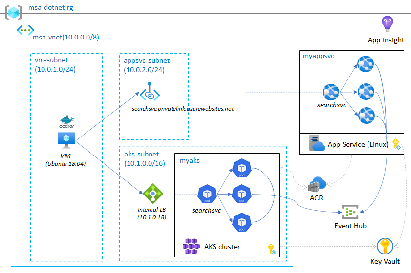

# Container-based Application HoL

This lab demonstrates to how to build and run container based application in Cloud native environment.

The sample app is a dotnet version of [msa-goapp](https://github.com/iljoong/msa-goapp).

## Lab

0. [Prepare this lab](./labs/lab0.md)
1. [Build and test container app locally](./labs/lab1.md)
2. [Run container app in App Service (Linux)](./labs/lab2.md)
3. [Run container app in AKS](./labs/lab3.md)
