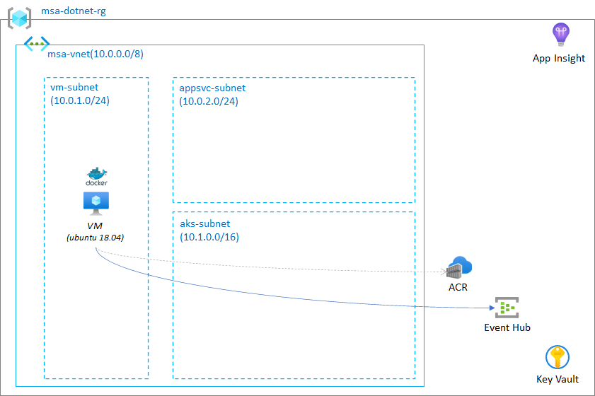

## Lab 1: Build and test container app locally



### 1.1 Run sample app locally

Clone sample app repo your VM if you haven't.

Move to `msa-dotnetapp/SearchWeb` directory, update `appsettings.json` and run app.

> update values following settings `ApplicationInsights:InstrumentationKey`, `http:endpoint`, `eh:eventhubname`, `eh:eventhubconn`.

```bash
dotnet run
```

Test locally running app.

```bash
$ curl -s localhost/api/search/web | jq
{
  "title": "web",
  "url": "https://dotnet.microsoft.com/",
  "snippet": "Free. Cross-platform. Open source.",
  "log": "2021-07-30T09:08:59Z, result for \"dotnet\", from backend 80, process time 0 msec",
  "time": 0
}
```

### 1.2 Build Docker container to test first container app

Review `Dockerfile` at the root of sample repo and build docker container locally.

```bash
$ docker build -t searchsvc:1 -t searchsvc:latest .

docker build -t searchsvc:1 -t searchsvc:latest .
Sending build context to Docker daemon  9.346MB
Step 1/15 : FROM mcr.microsoft.com/dotnet/sdk:5.0 AS build-env
 ---> fa98367f9017
Step 2/15 : WORKDIR /app
 ---> Running in 977276918dcc
Removing intermediate container 977276918dcc
 ---> ab7fe9b8ce1b
Step 3/15 : COPY . .
 ---> eba33e162839
Step 4/15 : WORKDIR /app/SearchWeb
 ---> Running in d3f68ef65d75
Removing intermediate container d3f68ef65d75
 ---> f795a82b5e7e
Step 5/15 : RUN dotnet restore
...
Step 14/15 : EXPOSE 8080 80 2222
 ---> Running in d900b1fe1e88
Removing intermediate container d900b1fe1e88
 ---> 17664977cbd5
Step 15/15 : ENTRYPOINT ["./init_container.sh"]
 ---> Running in a0381f7483a9
Removing intermediate container a0381f7483a9
 ---> dafa7344fb2a
Successfully built dafa7344fb2a
Successfully tagged searchsvc:1
Successfully tagged searchsvc:latest
```

Run docker container.

```bash
docker run -d -p 80:80 -p 2222:2222 --name searchsvc -e APP_PORT=80 searchsvc:latest
```

Test container app.

```bash
curl -s localhost/api/search/web | jq
{
  "title": "web",
  "url": "https://dotnet.microsoft.com/",
  "snippet": "Free. Cross-platform. Open source.",
  "log": "2021-07-30T09:08:59Z, result for \"dotnet\", from backend 80, process time 0 msec",
  "time": 0
}
```

- extra
```bash
docker ps -a
docker [stop | rm] <container name | id>
docker images
docker rmi
docker exec it <container name | id> bash
docker logs <container name | id>
```
### 1.3 Build container with ACR

Build and push a container to your ACR.
 
> login to your azure account, `$ az login`.

```
az acr build -r <acr name> -t searchsvc:1 -t searchsvc:latest .
```

Run a container from ACR.

```bash
docker run -d -p 80:80 -p 2222:2222 --name searchsvc -e APP_PORT=80 <youracr>.azurecr.io/searchsvc:latest
```