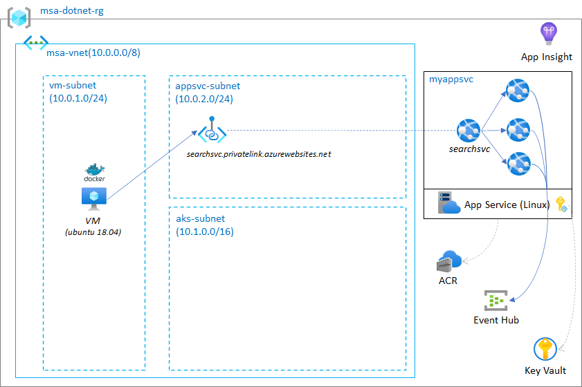
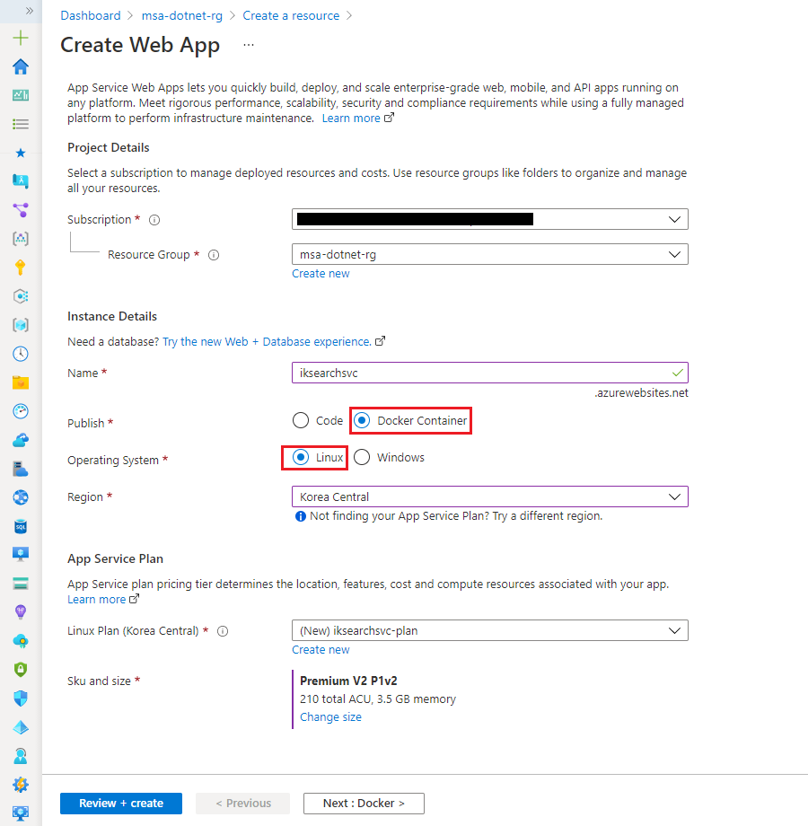
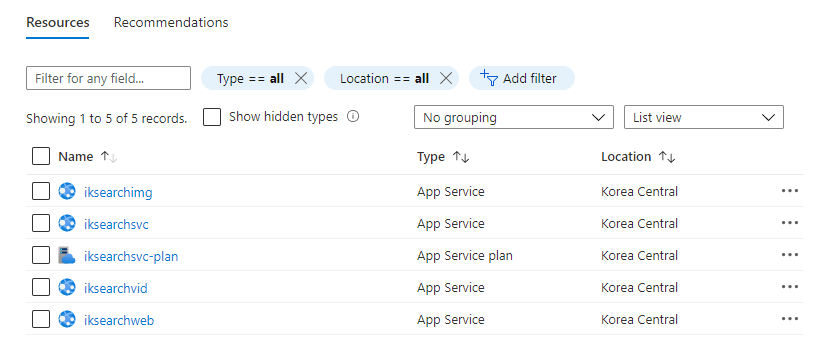
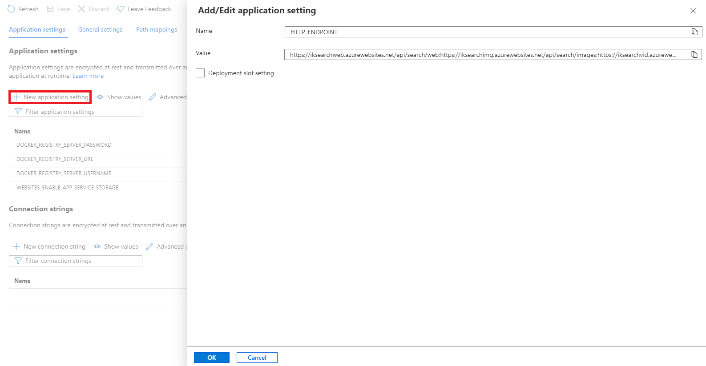
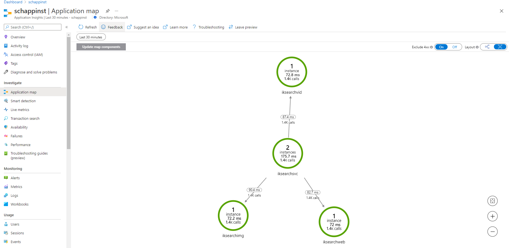
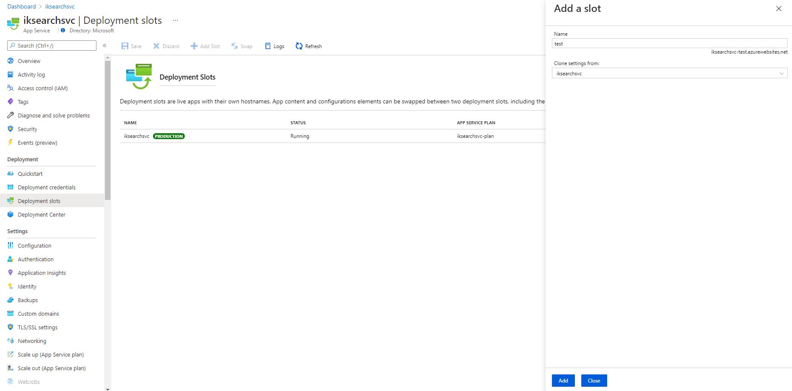
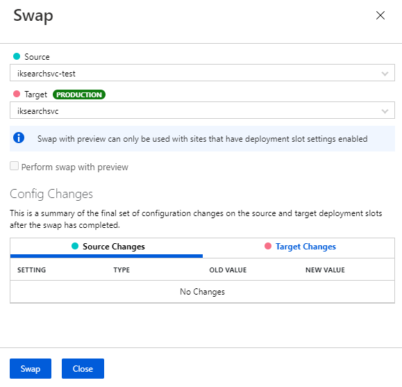

## Lab 2: Run container app in App Service (Linux)



### 2.1 Deploy container to App Service

Create a new App service and deploy container to App Service. Note that `App Service Plan` and a `Web App` are created automatically during creation. 

Use following `Web App` name: `<unique-prefix>searchsvc.azurewebsites.net`. (e.g., iksearchsvc.azurewebsites.net)

> :warning: Hard coded secrets/credentials in your application is not recommended for security. Instead, it is recommended to pass secrets via _ENVIRONMENT_ variables in App service configuration.



See [Step by step guide](./lab2_tips.md#Step_by_step_guide_to_deploy_App_Service) for more detail.

Test your application. Just like the previous local test, it simulates searching the web content.

```bash
curl -s https://iksearchsvc.azurewebsites.net/api/search/web | jq
```
```bash
{
  "title": "web",
  "url": "https://dotnet.microsoft.com/",
  "snippet": "Free. Cross-platform. Open source.",
  "log": "2021-08-07T02:48:09Z, result for \"dotnet\", from backend default, process time 0 msec",
  "time": 0
}
```

### 2.2 Deploy more apps to App Service

Deploy three more web apps with the same __app service plan__.

> :warning: Don't create a new service plan, re-use existing service plan for three web apps.

- iksearchweb.azurewebsites.net
- iksearchimg.azurewebsites.net
- iksearchvid.azurewebsites.net



Add `HTTP_ENDPOINT` environment variable and the value in `iksearchsvc`'s configuration and save the configuration. This will simulate searching all web, images and videos contents.

```
https://iksearchweb.azurewebsites.net/api/search/web;https://iksearchimg.azurewebsites.net/api/search/images;https://iksearchvid.azurewebsites.net/api/search/videos
```



Test with new search api endpoint (frontend). FYI, Frontend servce api (/api/web) will call 3 backend search apis (web, images, videos) and return aggregate results.

```bash
curl -s https://iksearchsvc.azurewebsites.net/api/web/seq | jq
```
```bash
{
  "results": [
    {
      "title": "web",
      "url": "https://dotnet.microsoft.com/",
      "snippet": "Free. Cross-platform. Open source.",
      "log": "2021-08-07T03:12:44Z, result for \"dotnet\", from backend default, process time 0 msec",
      "time": 0
    },
    {
      "title": "images",
      "url": "https://en.wikipedia.org/wiki/.NET_Core#/media/File:.NET_Core_Logo.svg",
      "snippet": ".NET Core Logo.",
      "log": "2021-08-07T03:12:44Z, result for \"dotnet\", from backend default, process time 0 msec",
      "time": 0
    },
    {
      "title": "vidoes",
      "url": "https://www.youtube.com/channel/UCvtT19MZW8dq5Wwfu6B0oxw",
      "snippet": "dotNET channel",
      "log": "2021-08-07T03:12:44Z, result for \"dotnet\", from backend default, process time 0 msec",
      "time": 0
    }
  ],
  "total_time": 52
}
```

### 2.3 Test performance using simulated environment

Test search with simulated random delay (10 ~ 100 ms)

```bash
curl -s https://iksearchsvc.azurewebsites.net/api/web/seq?delay=true | jq
```
```bash
{
  "results": [
    {
      "title": "web",
      "url": "https://dotnet.microsoft.com/",
      "snippet": "Free. Cross-platform. Open source.",
      "log": "2021-08-07T03:13:48Z, result for \"dotnet\", from backend default, process time 85 msec",
      "time": 85
    },
    {
      "title": "images",
      "url": "https://en.wikipedia.org/wiki/.NET_Core#/media/File:.NET_Core_Logo.svg",
      "snippet": ".NET Core Logo.",
      "log": "2021-08-07T03:13:48Z, result for \"dotnet\", from backend default, process time 50 msec",
      "time": 50
    },
    {
      "title": "vidoes",
      "url": "https://www.youtube.com/channel/UCvtT19MZW8dq5Wwfu6B0oxw",
      "snippet": "dotNET channel",
      "log": "2021-08-07T03:13:48Z, result for \"dotnet\", from backend default, process time 80 msec",
      "time": 80
    }
  ],
  "total_time": 359
}
```

>:information_source: If you want to send log to __Event Hub__, use following query parameter `?log=true`.
>
>```bash
>curl -s "https://iksearchsvc.azurewebsites.net/api/web/seq?log=true" | jq
> ```
>

Run `Apache Benchmarks` to see the performance comparison between sequential and concurrent backend requests.

(1) sequential backend request.
```bash
ab -n 100 -c 2 https://iksearchsvc.azurewebsites.net/api/web/seq?delay=true
```
```
This is ApacheBench, Version 2.3 <$Revision: 1807734 $>
Copyright 1996 Adam Twiss, Zeus Technology Ltd, http://www.zeustech.net/
Licensed to The Apache Software Foundation, http://www.apache.org/

Benchmarking iksearchsvc.azurewebsites.net (be patient).....done


Server Software:        Kestrel
Server Hostname:        iksearchsvc.azurewebsites.net
Server Port:            443
SSL/TLS Protocol:       TLSv1.2,ECDHE-RSA-AES256-GCM-SHA384,2048,256
TLS Server Name:        iksearchsvc.azurewebsites.net

Document Path:          /api/web/seq?delay=true
Document Length:        686 bytes

Concurrency Level:      2
Time taken for tests:   12.983 seconds
Complete requests:      100
Failed requests:        0
Total transferred:      89300 bytes
HTML transferred:       68600 bytes
Requests per second:    7.70 [#/sec] (mean)
Time per request:       259.652 [ms] (mean)
Time per request:       129.826 [ms] (mean, across all concurrent requests)
Transfer rate:          6.72 [Kbytes/sec] received

Connection Times (ms)
              min  mean[+/-sd] median   max
Connect:        6    8   3.7      8      42
Processing:   183  249  34.9    246     396
Waiting:      182  249  34.9    246     396
Total:        191  257  35.6    254     406

Percentage of the requests served within a certain time (ms)
  50%    254
  66%    268
  75%    279
  80%    283
  90%    299
  95%    320
  98%    355
  99%    406
 100%    406 (longest request)
 ```

(2) Concurrent backend request.
```bash
ab -n 100 -c 2 https://iksearchsvc.azurewebsites.net/api/web/para?delay=true
```
```
This is ApacheBench, Version 2.3 <$Revision: 1807734 $>
Copyright 1996 Adam Twiss, Zeus Technology Ltd, http://www.zeustech.net/
Licensed to The Apache Software Foundation, http://www.apache.org/

Benchmarking iksearchsvc.azurewebsites.net (be patient).....done


Server Software:        Kestrel
Server Hostname:        iksearchsvc.azurewebsites.net
Server Port:            443
SSL/TLS Protocol:       TLSv1.2,ECDHE-RSA-AES256-GCM-SHA384,2048,256
TLS Server Name:        iksearchsvc.azurewebsites.net

Document Path:          /api/web/para?delay=true
Document Length:        685 bytes

Concurrency Level:      2
Time taken for tests:   5.382 seconds
Complete requests:      100
Failed requests:        26
   (Connect: 0, Receive: 0, Length: 26, Exceptions: 0)
Total transferred:      89226 bytes
HTML transferred:       68526 bytes
Requests per second:    18.58 [#/sec] (mean)
Time per request:       107.639 [ms] (mean)
Time per request:       53.819 [ms] (mean, across all concurrent requests)
Transfer rate:          16.19 [Kbytes/sec] received

Connection Times (ms)
              min  mean[+/-sd] median   max
Connect:        6    8   2.0      8      23
Processing:    70  100  12.3    100     137
Waiting:       70   99  12.3    100     137
Total:         79  108  13.0    109     157

Percentage of the requests served within a certain time (ms)
  50%    109
  66%    113
  75%    116
  80%    117
  90%    121
  95%    127
  98%    146
  99%    157
 100%    157 (longest request)
```

### 2.4 Monitor your application

Open __Application Insight__ and review the performance. __Application Insight__ is a great observability tool for monitoring performance, troubleshooting and understanding user behaviors.



You can also view [performance](./images/lab2_11.png)

### 2.5 Deploy application safely with b/g deployment (Optional)

Modify you're application and push new container to ACR.

 - update the line 22 in `app/Controllers/WebController.cs` to `private const string _version = "v2";`
 - push new image to ACR, `az acr build -r <acr name> -t searchsvc:v2 .`

Update new image for the test slot by updating image tag to `v2` in the [Deployment Center](./images/lab2_07.png).

Create a _test slot_ for `iksearchsvc` and deploy the new container to the _test slot_.



Update Swap slots to deploy new app from _test_ to _production_ slot.

Run following command before swapping slots.

```
watch -n 1 curl -s https://iksearchsvc.azurewebsites.net/api/web
```

Swap slots and see the value of htp response.



### 2.6 Advanced: Private connectivity with Azure Web App (Optional)

Reference [document](https://docs.microsoft.com/en-us/azure/app-service/networking/private-endpoint)

### 2.7 Advanced: Referencing KV for Azure Web App (Optional)

Reference [document](https://docs.microsoft.com/en-us/azure/app-service/app-service-key-vault-references)