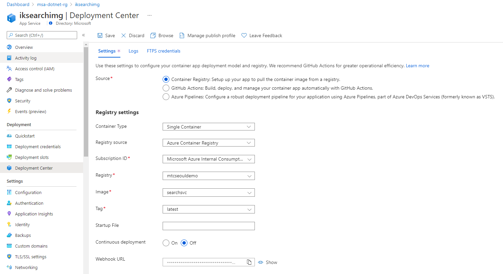

## Lab 2: Tips

###  Step by step guide to deploy App Service

Following is the step by step guide to deploy an Web App/App Service


### Change deployment after deploying Web App

If you accidentally create with wrong registry option, you can change in the __Deployment Center__ after creation.



### Fix errors

If you get an output like below, you haven't set `HTTP_ENDPOINT` in the configuration.
```
curl -s https://iksearchsvc.azurewebsites.net/api/web/seq | jq   
{
  "message": "Cannot assign requested address (localhost:5000)"
}
```

If you get an output like below, you didn't correctly configure `HTTP_ENDPOINT` in the configuration.
```
curl -s https://iksearchsvc.azurewebsites.net/api/web/seq | jq
{
  "message": "Name or service not known (iksearchimages.azurewebsites.net:443)"
}
```