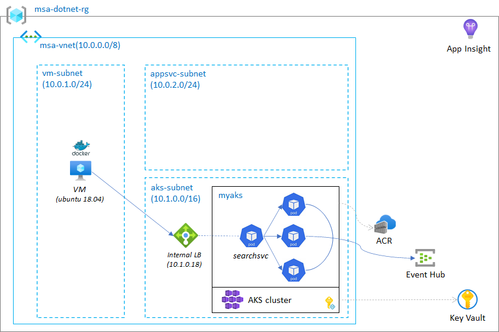

## Lab 3: Run container app in AKS



### 3.1 Provision AKS cluster

> For general information, see this reference [document](https://docs.microsoft.com/en-us/azure/aks/kubernetes-walkthrough-portal).

Provision a AKS cluster with CNI or kubenet. 

> If you're using CNI use the virtual network settings you've created in the begining of the lab.

Get k8s credentials and connect to AKS cluster.

```bash
az aks get-credentials --admin -n <aksname> -g <resourcegroup>
```

### 3.2 Deploy app to AKS

>:information_source: Lab 3 files are located in [aks](../aks) directory.

Review [searchsvc.yaml](../aks/yaml/searchsvc.yaml) and deploy search service app to AKS.
This deployment will create a public endpoint.

```bash
kubectl apply -f searchsvc.yaml
```

If you want to deploy a deployment for internal access only, you can deploy search service app with internal LB configuration to AKS.

> For internal load balancer for AKS, see this [documentation](https://docs.microsoft.com/en-us/azure/aks/internal-lb).

```bash
kubectl apply -f searchsvc_ilb.yaml
```

Review each searchsvc in the Kubernetes cluster.

```bash
kubectl get svc
```
```
NAME         TYPE           CLUSTER-IP     EXTERNAL-IP   PORT(S)        AGE
kubernetes   ClusterIP      10.2.0.1       <none>        443/TCP        5d16h
searchsvc    LoadBalancer   10.2.169.154   10.1.1.81     80:31851/TCP   4m15s
searchweb    ClusterIP      10.2.142.75    <none>        80/TCP         4m15s
```

Test request using internal load balancer IP.

```bash
curl http://10.1.1.81/api/web/all
```

- extra

```bash
kubectl get svc [-A | -n namespace]
kubectl get pod [-A | -n namespace]
kubectl delete [svc | pod] <name>
kubectl describe pod/<pod name>
kubectl exec it <pod name> -- bash
kubectl logs <pod name>
```

### 3.3 Deploy app to AKS using Helm

> see [document](https://docs.microsoft.com/en-us/azure/aks/quickstart-helm) for more information

Install `helm` and deploy searchapp service.

Create a new namespace (`prod`) and deploy search service using Helm chart.

```bash
kubectl create ns prod
helm install searchsvc ./searchsvc -n prod
```

### 3.4 Test performance using simulated environment

Run `Apache Benchmarks` to see the performance comparison between sequential and concurrent process.

```bash
ab -n 100 -c 2 http://10.1.1.81/api/web/seq?delay=true
```

```bash
ab -n 100 -c 2 http://10.1.1.81/api/web/para?delay=true
```

### 3.5 Integrate AKS with KV for reading application settings (Optional)

Reference [document](https://docs.microsoft.com/en-us/azure/key-vault/general/key-vault-integrate-kubernetes)
