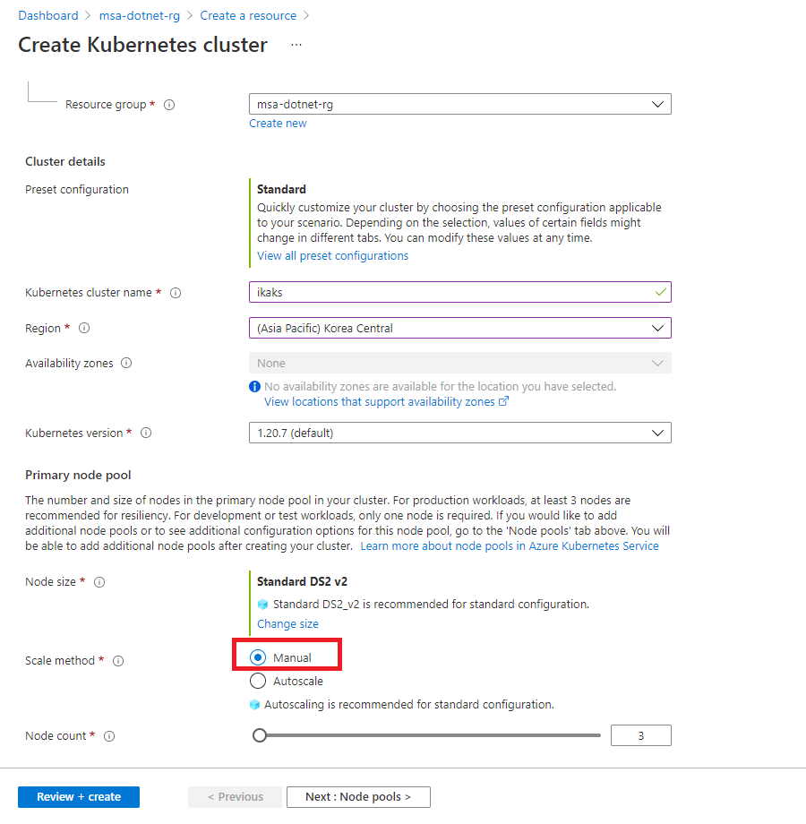

## Lab 3: Run container app in AKS


### 3.1 Provision AKS cluster

> For general information, see this reference [document](https://docs.microsoft.com/en-us/azure/aks/kubernetes-walkthrough-portal).

Provision a AKS cluster with CNI or kubenet.



> If you're using CNI use the virtual network settings you've created in the beginning of the lab.


See [Step by step guide](./lab3_tips.md#Step_by_step_guide_to_deploy_AKS) for more detail.

Get k8s credentials and connect to AKS cluster.

```bash
az aks get-credentials --admin -n <aksname> -g <resourcegroup>
```

Test connection of kubernetes cluster.

```bash
kubectl get svc
```
```bash
NAME         TYPE        CLUSTER-IP   EXTERNAL-IP   PORT(S)   AGE
kubernetes   ClusterIP   10.2.0.1     <none>        443/TCP   10m
```

### 3.2 Deploy app to AKS

>:information_source: Lab 3 files are located in [aks](../aks) directory.

Move to `~/msa-dotnetapp/aks/yaml` directory. Review [searchsvc.yaml](../aks/yaml/searchsvc.yaml) and replace container image to your own container registry image in `searchsvc.yaml`. 

```
image: "youracr.azurecr.io/searchsvc:latest"
```

Deploy search service app to AKS.

> This deployment will create a public endpoint.

```bash
kubectl apply -f searchsvc.yaml
```
```
deployment.apps/searchsvc created
service/searchsvc created
deployment.apps/searchweb created
service/searchweb created
```

Get external-IP of searchsvc
```bash
kubectl get svc
```
```
NAME         TYPE           CLUSTER-IP     EXTERNAL-IP     PORT(S)        AGE
kubernetes   ClusterIP      10.2.0.1       <none>          443/TCP        23m
searchsvc    LoadBalancer   10.2.191.109   52.231.64.194   80:30239/TCP   26s
searchweb    ClusterIP      10.2.205.23    <none>          80/TCP         26s
```

Test it.
```
curl -s http://52.231.64.194/api/web/para | jq
```
```
{
  "results": [
    {
      "title": "web",
      "url": "https://dotnet.microsoft.com/",
      "snippet": "Free. Cross-platform. Open source.",
      "log": "2021-08-07T11:58:12Z, result for \"dotnet\", from backend 80, process time 0 msec",
      "time": 0
    },
    {
      "title": "images",
      "url": "https://en.wikipedia.org/wiki/.NET_Core#/media/File:.NET_Core_Logo.svg",
      "snippet": ".NET Core Logo.",
      "log": "2021-08-07T11:58:12Z, result for \"dotnet\", from backend 80, process time 0 msec",
      "time": 0
    },
    {
      "title": "vidoes",
      "url": "https://www.youtube.com/channel/UCvtT19MZW8dq5Wwfu6B0oxw",
      "snippet": "dotNET channel",
      "log": "2021-08-07T11:58:12Z, result for \"dotnet\", from backend 80, process time 0 msec",
      "time": 0
    }
  ],
  "total_time": 12
}
```

If you want to deploy a deployment for internal access only, you can deploy search service app with internal LB configuration to AKS.

> For internal load balancer for AKS, see this [documentation](https://docs.microsoft.com/en-us/azure/aks/internal-lb).

```bash
kubectl apply -f searchsvc_ilb.yaml
```

Get external-IP of searchsvc. You will get the private IP address instead of public IP address.

```bash
kubectl get svc
```
```
NAME         TYPE           CLUSTER-IP     EXTERNAL-IP   PORT(S)        AGE
kubernetes   ClusterIP      10.2.0.1       <none>        443/TCP        34m
searchsvc    LoadBalancer   10.2.141.208   10.1.1.81     80:30332/TCP   89s
searchweb    ClusterIP      10.2.197.54    <none>        80/TCP         89s
```

Test it using internal load balancer IP.

```bash
curl -s http://10.1.1.81/api/web/para | jq
```

- extra

```bash
kubectl get svc [-A | -n namespace]
kubectl get pod [-A | -n namespace]
kubectl delete [svc | pod] <name>
kubectl describe pod/<pod name>
kubectl exec it <pod name> -- bash
kubectl logs <pod name>
```

### 3.3 Deploy app to AKS using Helm

> see [document](https://docs.microsoft.com/en-us/azure/aks/quickstart-helm) for more information

Install `helm` and deploy searchsvc service.

Move to `~/msa-dotnetapp/aks/helm` directory. Review [values.yaml](../aks/helm/searchsvc/values.yaml) and replace container image to your own container registry image in `values.yaml`. Replace container image in three more `values.yaml` under `~/msa-dotnetapp/aks/helm/searchsvc/charts` directory.

Create a new namespace (`prod`) and deploy search service using Helm chart by following commands.

```bash
kubectl create ns prod
helm install searchsvc ./searchsvc -n prod
```

Review deployment using helm.

```
helm list -n prod
```
```
NAME            NAMESPACE       REVISION        UPDATED                                 STATUS          CHART          APP VERSION
searchsvc       prod            1               2021-08-07 12:05:18.942325816 +0000 UTC deployed        searchsvc-0.1.0latest
```
### 3.4 Test performance using simulated environment

Run `Apache Benchmarks` to see the performance comparison between sequential and concurrent process.

```bash
ab -n 100 -c 2 http://10.1.1.81/api/web/seq?delay=true
```

```bash
ab -n 100 -c 2 http://10.1.1.81/api/web/para?delay=true
```

### 3.5 Integrate AKS with KV for reading application settings (TBU)

Reference [document](https://docs.microsoft.com/en-us/azure/key-vault/general/key-vault-integrate-kubernetes)
